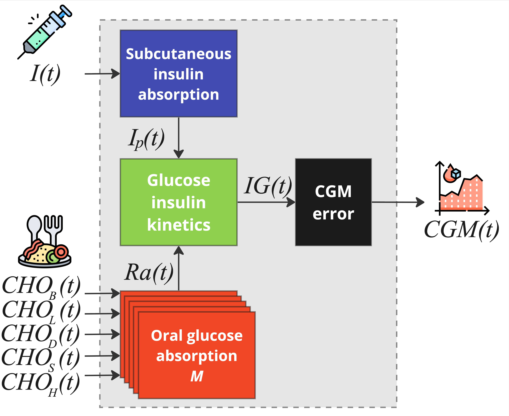

# Multi Meal Blueprint

The **multi-meal** blueprint pairs `MultiMealT1DModel` with `MultiMealT1DData`. Use
it to twin a portion of data spanning a **single day**, with multiple labelled
meals and a time-of-day insulin sensitivity. It is the most common choice.

## Usage

```python
from data.multi_meal_t1d_data import MultiMealT1DData
from model.multi_meal_t1d import MultiMealT1DModel

rbg_data = MultiMealT1DData(data=df, environment=rbg.environment)

# The model needs the minute-of-day of the first sample so the time-of-day
# insulin sensitivity lines up.
t_start = int((df["t"].iloc[0] - df["t"].iloc[0].normalize()).total_seconds() / 60)
model = MultiMealT1DModel(u2ss=rbg_data.u2ss, tsteps=rbg_data.tsteps, t_start=t_start)
```

The data class routes each meal by its `cho_label` into a dedicated channel. Its
input channels (`data_to_input`) are: `meal_B`, `meal_L`, `meal_D`, `meal_S`,
`meal_H`, `bolus`, `basal`, `t_hour`, `forcing_ip`, `forcing_ra`.

## Structure

The multi-meal blueprint is an expanded version of the [single-meal](single_meal.md)
one, sharing the subcutaneous insulin absorption and the glucose–insulin kinetics
subsystems, but replacing the single stomach with a **multi-stomach** system and
using a **time-varying insulin sensitivity**.

{ .rbg-figure }

### Oral glucose absorption (multi-stomach)

Each meal type gets its own three-compartment stomach/gut chain:

$$
\begin{cases}
   \dot{Q}_{sto1_M}(t) = - k_{empt}\cdot Q_{sto1_M}(t)  + CHO_M(t-\beta_M) \\
   \dot{Q}_{sto2_M}(t) = k_{empt}\cdot Q_{sto1_M}(t) - k_{empt}\cdot Q_{sto2_M}(t)\\
   \dot{Q}_{gut_M}(t) = k_{empt}\cdot Q_{sto2_M}(t) - k_{abs_M}\cdot Q_{gut_M}(t)
\end{cases}
\qquad
Ra(t) = f\cdot \sum_{M}k_{abs_M} \cdot Q_{gut_M}(t)
$$

where the suffix $M \in \{B, L, D, S, H\}$ denotes the meal type (breakfast, lunch,
dinner, snack, hypo-treatment). Each meal type has its own absorption rate
$k_{abs_M}$ and delay $\beta_M$ (with $\beta_H = 0$, since hypo-treatments are
fast-absorbing).

### Time-of-day insulin sensitivity

The insulin action equation uses a **time-varying** sensitivity $SI(t)$ to capture
intraday variability:

$$
SI(t) = \begin{cases}
   SI_B & \text{if } 4\text{ AM} \le t < 11\text{ AM} \\
   SI_L & \text{if } 11\text{ AM} \le t < 5\text{ PM} \\
   SI_D & \text{if } t < 4\text{ AM } \text{ or } t \ge 5\text{ PM}
\end{cases}
$$

This is why the model needs `t_start` (the minute-of-day of the first sample) — it
selects the right sensitivity for each step.

### Parameter vector

The set of unknown parameters estimated by [twinning](../twinning.md) is:

$$\boldsymbol{\theta}_{phy} = [\{k_{abs_M}, \beta_M\}_{M\in\{B,L,D,S,H\}}, k_{empt}, k_{a2}, k_{d}, G_b, S_G, SI_B, SI_L, SI_D]^T$$

So relative to single-meal, the sensitivity `SI` is replaced by `SI_B`, `SI_L`,
`SI_D`, and absorption/delay become per-meal (`kabs_B`, `kabs_L`, `kabs_D`,
`kabs_S`, `kabs_H`; `beta_B`, `beta_L`, `beta_D`, `beta_S`).

!!! tip "Parameters for events that are not in your data"
    If your data has no lunch event, `kabs_L` and `beta_L` simply cannot be
    personalized — just leave them out of `unknown_parameters_prior` and they keep
    their population defaults. Estimate only the parameters your data can inform.

## What can I do with it?

You can create a digital twin from a portion of data that spans a **single day**,
because the equations represent the meals of one day (via
$\{k_{abs_M}, \beta_M\}$) and a one-day insulin-sensitivity profile. To go beyond a
single day, chain multiple daily twins — see
[Twinning multi-day intervals](../twinning.md#twinning-multi-day-intervals).

As with single-meal, the model starts from **steady state**, so pick a starting
point far from the last recorded insulin/meal input. See
[Choosing Data for Twinning](../data_requirements.md).

## Example

A complete multi-meal twinning example lives in
[`example/twin_multi_meal.py`](https://github.com/DIANA-UNIPD/replaybg/blob/main/example/twin_multi_meal.py).
The `unknown_parameters_prior` used there is exactly the one shown in
[Getting Started](../getting_started.md#step-1-create-the-digital-twin-twin).
