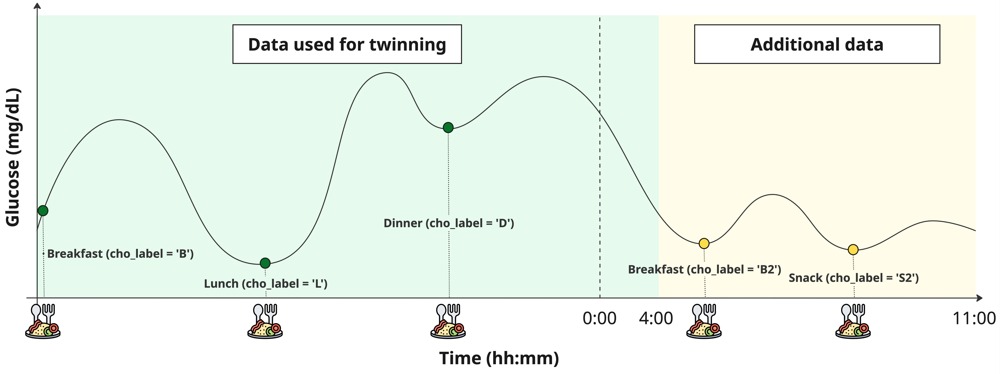

# Multi Meal Extended Blueprint

The **multi-meal extended** blueprint pairs `MultiMealExtendedT1DModel` with
`MultiMealExtendedT1DData`. It augments the [multi-meal](multi_meal.md) model with
**second-occurrence** meal labels so twinning can reach into a second day.

## Why extended?

When twinning, it is often useful to run the procedure on **more data than
strictly necessary**. This avoids wrong parameters for the *last* meals of the
window — the "tail effect".

For example: a dinner at 22:00 in a window that ends at 23:00 gives the twinner
only one hour to understand the dinner's absorption rate, which is hard. If you
have data *after* the window, you can leverage those extra points to constrain the
estimate.

{ .rbg-figure }

The extended blueprint handles this by adding a **second occurrence** of the
breakfast, lunch and snack meals — labelled `B2`, `L2`, `S2` — each with its own
absorption rate (`kabs_B2`, `kabs_L2`, `kabs_S2`) and delay (`beta_B2`, `beta_L2`,
`beta_S2`), plus a second breakfast insulin sensitivity `SI_B2`.

!!! tip "Where to cut the extra data"
    Since the insulin-sensitivity profile repeats from 04:00, it is advised that
    the primary window stop at 04:00. To keep computation reasonable, the extra
    portion should not extend much past 11:00 of the next day.

## Usage

```python
from data.multi_meal_extended_t1d_data import MultiMealExtendedT1DData
from model.multi_meal_extended_t1d import MultiMealExtendedT1DModel

rbg_data = MultiMealExtendedT1DData(data=df, environment=rbg.environment)
t_start = int((df["t"].iloc[0] - df["t"].iloc[0].normalize()).total_seconds() / 60)
model = MultiMealExtendedT1DModel(u2ss=rbg_data.u2ss, tsteps=rbg_data.tsteps, t_start=t_start)
```

Its input channels (`data_to_input`) extend the multi-meal ones with the
second-occurrence meals: `meal_B`, `meal_L`, `meal_D`, `meal_S`, `meal_H`,
`meal_B2`, `meal_L2`, `meal_S2`, `bolus`, `basal`, `t_hour`, `forcing_ip`,
`forcing_ra`.

## Preparing the data

Flag the meal events of the *additional* portion by appending a `2` to their
labels: `B` → `B2`, `L` → `L2`, `S` → `S2`. There is no need to relabel the
insulin boluses, nor the hypo-treatments. For example:

```python
import numpy as np

# Split at 04:00: everything after is the "extra" second-day portion.
hours = np.array([t.hour for t in df.t])
idx_split = np.where(hours == 3)[0][-1] + 1

for label in ('B', 'L', 'S'):
    idx = np.where(df.cho_label.values == label)[0]
    idx = idx[idx > idx_split]
    df.loc[idx, "cho_label"] = label + '2'
```

## Parameter vector

Relative to [multi-meal](multi_meal.md), the extended blueprint adds the
second-occurrence parameters:

`kabs_B2`, `kabs_L2`, `kabs_S2`, `beta_B2`, `beta_L2`, `beta_S2`, and `SI_B2`.

## Example

A complete extended twinning example lives in
[`example/twin_multi_meal_extended.py`](https://github.com/DIANA-UNIPD/replaybg/blob/main/example/twin_multi_meal_extended.py).
Its `unknown_parameters_prior` is the multi-meal one plus the extra second-day
entries:

```python
unknown_parameters_prior = {
    # ... the multi-meal parameters (Gb, SG, p2, kd, kempt, SI_B/L/D,
    #     kabs_B/L/D/S, beta_B/L/D/S) ...
    'kabs_B2': {'prior': LogNormal(mu=-5.4591, sigma=1.4396), 'min': 0, 'max': .5},
    'kabs_L2': {'prior': LogNormal(mu=-5.4591, sigma=1.4396), 'min': 0, 'max': .5},
    'kabs_S2': {'prior': LogNormal(mu=-5.4591, sigma=1.4396), 'min': 0, 'max': .5},
    'beta_B2': {'prior': Uniform(a=0, b=60), 'min': 0, 'max': 60, 'integer': True},
    'beta_L2': {'prior': Uniform(a=0, b=60), 'min': 0, 'max': 60, 'integer': True},
    'beta_S2': {'prior': Uniform(a=0, b=60), 'min': 0, 'max': 60, 'integer': True},
    'SI_B2':   {'prior': Gamma(alpha=3.3, beta=1 / 5e-4), 'min': 0, 'max': .1},
}
```

!!! note "Remember to trim before replaying"
    The extra portion exists only to constrain the twinning fit. Before
    [replaying](../replay.md), cut the data back to the primary window
    (`df = df.iloc[0:idx_split, :]`).
