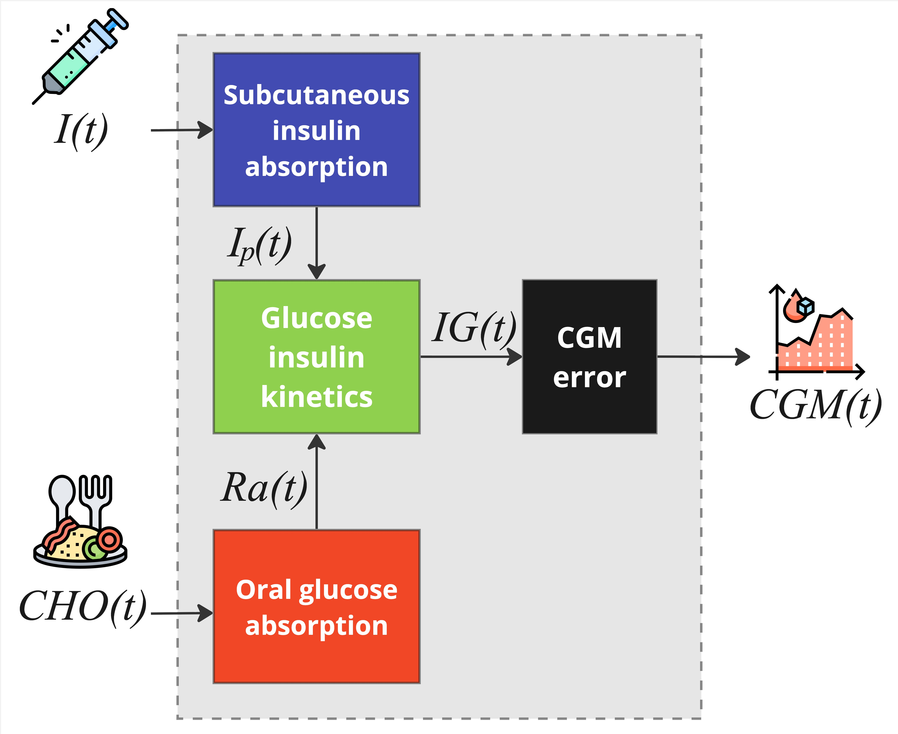

# Single Meal Blueprint

The **single-meal** blueprint pairs `SingleMealT1DModel` with `SingleMealT1DData`.
Use it to twin a portion of data that contains **just one main meal** — e.g. a
breakfast, a lunch, a dinner, or a snack — spanning no more than about 8 hours.

## Usage

```python
from data.single_meal_t1d_data import SingleMealT1DData
from model.single_meal_t1d import SingleMealT1DModel

rbg_data = SingleMealT1DData(data=df, body_weight=100, environment=rbg.environment)
model = SingleMealT1DModel(u2ss=rbg_data.u2ss, tsteps=rbg_data.tsteps)
```

The data class ignores the `cho_label` column here (all carbs are treated as a
single meal), and the model exposes a single insulin sensitivity `SI`. Its input
channels (`data_to_input`) are: `meal`, `bolus`, `basal`, `forcing_ip`,
`forcing_ra`.

## Structure

The single-meal blueprint is composed of three physiological subsystems —
subcutaneous insulin absorption, oral glucose absorption, glucose–insulin kinetics
— plus a [CGM sensor error model](../cgm_model.md) applied at replay.

{ .rbg-figure }

### Subcutaneous insulin absorption

A three-compartment description of exogenous insulin infusion reaching plasma:

$$
\begin{cases}
   \dot{I}_{sc1}(t) = -  k_d \cdot I_{sc1}(t)  + I(t-\gamma)/V_I \\
   \dot{I}_{sc2}(t) = k_{d} \cdot I_{sc1}(t) - k_{a2} \cdot I_{sc2}(t) \\
   \dot{I}_{p}(t) = k_{a2}\cdot I_{sc2}(t) - k_e \cdot I_p(t)
\end{cases}
$$

where $I_{sc1}$, $I_{sc2}$ (mU/kg) are insulin in the non-monomeric and monomeric
state; $I_p$ (mU/l) is plasma insulin; $k_d$ is the diffusion rate; $k_{a2}$ the
absorption rate; $k_e$ the clearance rate; $V_I$ the insulin distribution volume;
$\gamma$ the appearance delay.

### Oral glucose absorption

A three-compartment gastro-intestinal tract (two stomach compartments plus the
gut where CHO is absorbed):

$$
\begin{cases}
   \dot{Q}_{sto1}(t) = - k_{empt}\cdot Q_{sto1}(t)  + CHO(t-\beta) \\
   \dot{Q}_{sto2}(t) = k_{empt}\cdot Q_{sto1}(t) - k_{empt}\cdot Q_{sto2}(t)\\
   \dot{Q}_{gut}(t) = k_{empt}\cdot Q_{sto2}(t) - k_{abs}\cdot Q_{gut}(t)
\end{cases}
$$

The rate of glucose appearance in plasma is $Ra(t) = f\cdot k_{abs} \cdot
Q_{gut}(t)$, with $f$ the fraction of intestinal content absorbed, $k_{empt}$ the
gastric-emptying rate, $k_{abs}$ the intestinal-absorption rate, and $\beta$ the
meal-absorption delay.

### Glucose–insulin kinetics

$$
\begin{cases}
   \dot{G}(t) = - [SG + \rho(G) X(t)] \cdot G(t) + SG \cdot G_b + Ra(t) / V_G \\
   \dot{X}(t) = - p_2 \cdot [X(t) - SI\cdot(I_p(t)-I_{pb})] \\
   \dot{IG}(t) = - \frac{1}{\alpha}(IG(t) - G(t))
\end{cases}
$$

where $G$ (mg/dl) is plasma glucose, $X$ the insulin action, $IG$ the interstitial
glucose (the CGM-observable signal), $SG$ the glucose effectiveness, $G_b$ the
basal glucose, $V_G$ the glucose distribution volume, $p_2$ the insulin-action
rate, $SI$ the insulin sensitivity, and $\rho(G)$ a function that increases insulin
action in the hypoglycemic range.

### Parameter vector

The set of unknown parameters estimated by [twinning](../twinning.md) is:

$$\boldsymbol{\theta}_{phy} = [k_{empt}, k_{abs}, \beta, k_{a2}, k_{d}, G_b, S_G, SI]^T$$

The full set of parameters the model exposes (with physiological defaults for any
you do not estimate) is: `f`, `VG`, `VI`, `alpha`, `SI`, `SG`, `Gb`, `p2`, `r1`,
`r2`, `ka2`, `kd`, `ke`, `tau`, `kabs`, `kempt`, `beta` (with `alpha`, `tau`,
`beta` integer-valued).

## What can I do with it?

You can create a digital twin from a portion of data that contains **exactly one
main meal** and spans no more than ~8 hours, because the equations represent a
single meal absorption ($k_{empt}, k_{abs}, \beta$) and a single value of insulin
sensitivity.

Because the model starts from **steady-state** conditions, be careful to pick a
starting point sufficiently far (e.g. ~4 hours) from the last recorded
insulin/meal input. See [Choosing Data for Twinning](../data_requirements.md).

## Example

A complete single-meal twinning example lives in
[`example/twin_single_meal.py`](https://github.com/SHIELD-UNIPD/replaybg/blob/main/example/twin_single_meal.py):

```python
from data.single_meal_t1d_data import SingleMealT1DData
from model.single_meal_t1d import SingleMealT1DModel
from distributions import Normal, Gamma, LogNormal, Uniform
from replaybg import ReplayBG

rbg = ReplayBG()
rbg_data = SingleMealT1DData(data=df, body_weight=100, environment=rbg.environment)
model = SingleMealT1DModel(u2ss=rbg_data.u2ss, tsteps=rbg_data.tsteps)

unknown_parameters_prior = {
    'Gb':    {'prior': Normal(mu=119.13, sigma=7.11),       'min': 70, 'max': 150},
    'SG':    {'prior': LogNormal(mu=-3.8, sigma=0.5),       'min': 0,  'max': .5},
    'p2':    {'prior': Normal(mu=0.11, sigma=0.004),        'min': 0,  'max': .5},
    'f':     {'prior': Normal(mu=0.8, sigma=0.05),          'min': 0,  'max': 1},
    'ka2':   {'prior': LogNormal(mu=-4.2875, sigma=0.4274), 'min': 0,  'max': .5},
    'kd':    {'prior': LogNormal(mu=-3.5090, sigma=0.6187), 'min': 0,  'max': .5},
    'kempt': {'prior': LogNormal(mu=-1.9646, sigma=0.7069), 'min': 0,  'max': .75},
    'SI':    {'prior': Gamma(alpha=3.3, beta=1 / 5e-4),     'min': 0,  'max': .1},
    'kabs':  {'prior': LogNormal(mu=-5.4591, sigma=1.4396), 'min': 0,  'max': .5},
    'beta':  {'prior': Uniform(a=0, b=60), 'min': 0, 'max': 60, 'integer': True},
}

result = rbg.twin(rbg_data=rbg_data, model=model,
                  unknown_parameters_prior=unknown_parameters_prior,
                  parallelize=True, n_jobs=-1, n_starts=16, log_history=True)
```
