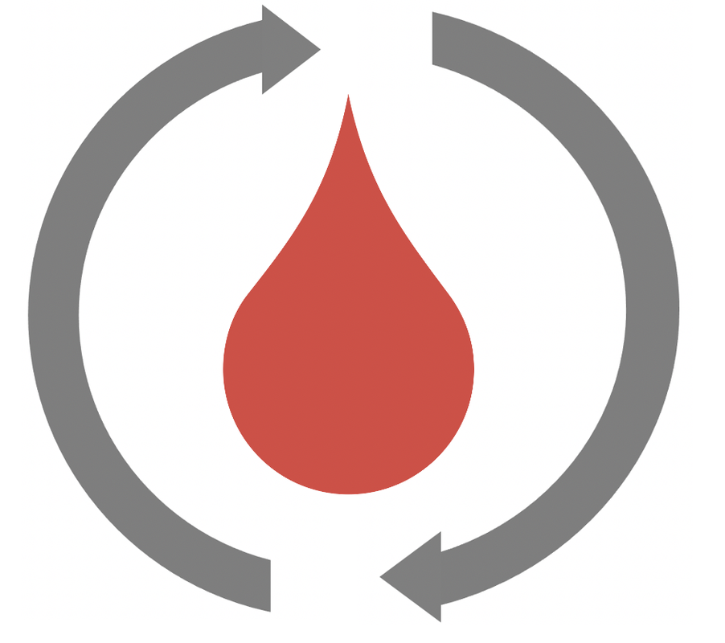

---
hide:
  - navigation
  - toc
---

<div class="rbg-hero" markdown>



# ReplayBG

<p class="tagline">A digital-twin based framework for the development and assessment of
new algorithms for type 1 diabetes management.</p>

<div class="rbg-cta" markdown>
[Get Started](getting_started.md){ .md-button .md-button--primary }
[View on GitHub](https://github.com/DIANA-UNIPD/replaybg){ .md-button }
</div>

</div>

<div class="rbg-features" markdown>

<div class="card" markdown>
<div class="icon">🧬</div>
### Digital Twin
ReplayBG fits a physiological ODE model to a person's CGM + insulin + meal data
(**twinning**), producing a personalized *digital twin* of their glucose–insulin
system.
</div>

<div class="card" markdown>
<div class="icon">🔬</div>
### State of the Art
Built on validated T1D physiological models and a principled MAP identification
procedure, and integrated with [AGATA](https://github.com/gcappon/py_agata) for
standardized glucose-metric analysis.
</div>

<div class="card" markdown>
<div class="icon">⚡</div>
### Easy to Use
A tiny API — `twin()` and `replay()` — lets you ask *what-if*: what would this
person's glucose have looked like with a different dose, a different meal, or a
control algorithm in the loop?
</div>

</div>

## What is ReplayBG?

ReplayBG is a digital-twin framework for **Type 1 Diabetes (T1D)** glucose
dynamics. It works in two steps:

1. **Twinning** — it fits a physiological model to a person's recorded CGM,
   insulin and meal data, estimating the parameter set (`theta`) that best
   explains that data. This fitted model *is* the digital twin.
2. **Replay** — it forward-simulates the twin under **counterfactual** scenarios:
   a different insulin dose, a modified meal, a bolus calculator, a hypo-treatment
   policy, or a full control algorithm in the loop — and predicts the resulting
   glucose trace.

```
 raw DataFrame            Data class              Model (Numba jitclass)
 t, glucose, cho,   ─▶   SingleMealT1DData  ─▶   SingleMealT1DModel   ─┐
 bolus, basal, ...       MultiMealT1DData        MultiMealT1DModel     │
                         MultiMealExtended…      MultiMealExtended…    │
        ┌──────────────────────────────────────────────────────────  ┘
        │
        ├─▶  rbg.twin()    MAP estimation (multi-start Powell)  ─▶  theta (the digital twin)
        │
        └─▶  rbg.replay()  forward simulation with theta        ─▶  predicted glucose trace
```

Ready to build your first digital twin? Head to
[Getting Started](getting_started.md).

## Reference

If you use ReplayBG in your research, please cite:

> G. Cappon, M. Vettoretti, G. Sparacino, S. Del Favero, and A. Facchinetti,
> "ReplayBG: A Digital Twin-Based Methodology to Identify a Personalized Model
> From Type 1 Diabetes Data and Simulate Glucose Concentrations to Assess
> Alternative Therapies," *IEEE Transactions on Biomedical Engineering*, vol. 70,
> no. 11, pp. 3227–3238, Nov. 2023,
> doi: [10.1109/TBME.2023.3286856](https://doi.org/10.1109/TBME.2023.3286856).

```bibtex
@article{cappon2023replaybg,
  author  = {Cappon, Giacomo and Vettoretti, Martina and Sparacino, Giovanni and Del Favero, Simone and Facchinetti, Andrea},
  title   = {{ReplayBG}: A Digital Twin-Based Methodology to Identify a Personalized Model From Type 1 Diabetes Data and Simulate Glucose Concentrations to Assess Alternative Therapies},
  journal = {IEEE Transactions on Biomedical Engineering},
  volume  = {70},
  number  = {11},
  pages   = {3227--3238},
  year    = {2023},
  doi     = {10.1109/TBME.2023.3286856},
}
```

## Research

ReplayBG has been used and validated across a range of studies on T1D modeling,
digital twins, and decision-support systems. For the full and up-to-date list of
publications on ReplayBG's development and its use as a component or validation
tool, see the [reference paper](https://doi.org/10.1109/TBME.2023.3286856) above
and the maintainers' research pages.
