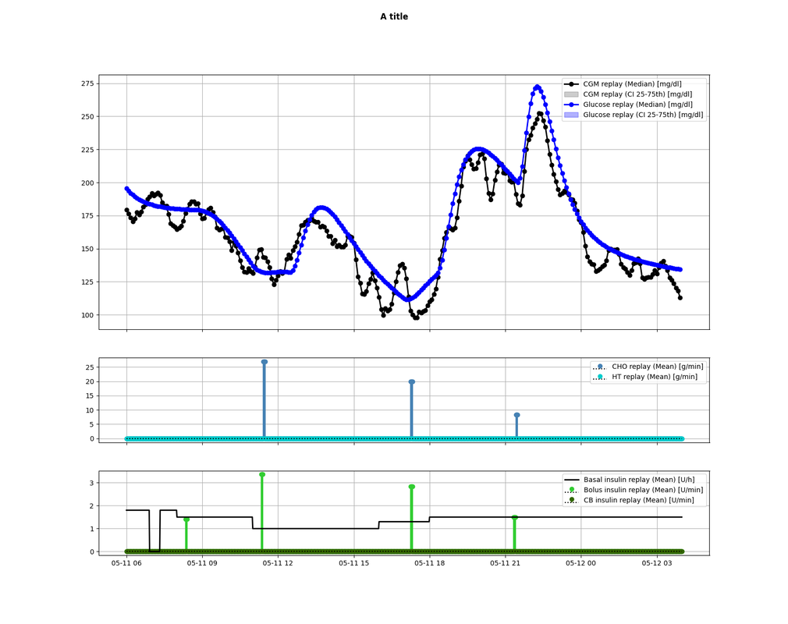

# Plotting Utilities

ReplayBG ships painless matplotlib helpers to visualize twinning fits and replay
simulations. They all share the same rationale: a **vertical stack of subplots
sharing a common time axis** — the output/fit on top, one subplot per input group
below, and (for replays) one subplot per callback. All are model-agnostic:
channel names come straight from `data_to_input`.

They live in `utils` and return a `matplotlib.figure.Figure`.

## Common conventions

Two arguments recur across every plot:

- **`thresholds=[70, 180]`** — draws dashed reference lines at those levels and
  shades the target band between the outermost two.
- **`mask_inputs=[...]`** — hides channels by index; every example hides the
  internal `t_hour` channel:

  ```python
  mask_inputs = [i for i, name in rbg_data.data_to_input.items() if name == 't_hour']
  ```

- **`input_groups=[[0,1,2,3,4],[5],[6]]`** — overlays several channels in one
  subplot instead of one-per-subplot (e.g. all meals together, bolus, basal).

## `plot_twinning`

Shows how well the fitted model reproduces the observed data.

```python
from utils.plot_twinning import plot_twinning

fig = plot_twinning(rbg_data, model, theta=result['theta'],
                    thresholds=[70, 180], mask_inputs=mask_inputs)
fig.show()
```

- **Top subplot** — the simulated model `output` for the estimated `theta`
  (line) vs. the observed data `rbg_data.y` at the non-missing indices (markers),
  with the threshold band.
- **Input subplots** — the inputs that drove the fit.

Signature (abbreviated): `plot_twinning(rbg_data, model, theta=None,
thresholds=None, input_groups=None, mask_inputs=None, ts_min=1.0,
output_label="Fit", observation_label="Data", figsize=None, hover=True)`.

For multi-day interval fits, `plot_twinning_intervals(segments, ...)` stitches the
per-day segments into one continuous figure.

## `plot_replay`

{ .rbg-figure }

Shows the outcome of a replay.

```python
from utils.plot_replay import plot_replay

fig = plot_replay(replay_results, thresholds=[70, 180], mask_inputs=mask_inputs)
fig.show()
```

- **Top subplot** — the replayed `output` (line) and, when a sensor was used, the
  `measurement` samples (markers), with the threshold band.
- **Input subplots** — the applied input channels.
- **Callback subplots** — one per distinct callback, stemming the value each
  action logged (e.g. correction-bolus units, rescue-carb grams).

Signature (abbreviated): `plot_replay(replay_results, thresholds=None,
input_groups=None, mask_inputs=None, action_field=None, ts_min=1.0,
output_label="Output", measurement_label="Measurement", figsize=None,
hover=True)`.

For multi-day interval replays, `plot_replay_intervals(...)` stitches the segments
into one figure.

## `plot_twinning_history`

When you twin with `log_history=True`, this shows the optimisation trajectory —
useful to sanity-check convergence.

```python
from utils.plot_twinning_history import plot_twinning_history

if result['history'] is not None:
    plot_twinning_history(result['history'],
                          param_names=list(unknown_parameters_prior.keys()))
```

- **Parameter trajectory** — each unknown parameter's value per function evaluation.
- **Log-prior / log-likelihood / log-posterior** — the three terms the twinner is
  optimising, one subplot each. The x-axis is the function evaluation, not time.

## Interactive hover

All three functions attach an interactive readout by default (`hover=True`):
hovering any subplot drops a vertical cursor across the whole stack and reports the
values at that time/evaluation. It is ignored on non-interactive backends.
